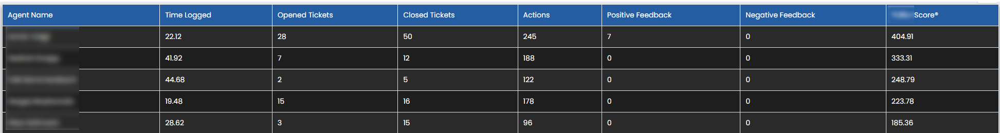

# HaloPSA report for support team performance


This report will allow you to analyze the performance of your support team members. It requires a custom field "cfbonusmultiplier" for agents, which is used to weight first level techs and second level techs differently. First level techs will close more tickets, but only because their tickets are way easier. So this field is quite important. I suggest using 2 for first level techs and 4 for second level techs.

On line 87 there's a clause to exclude specific HaloPSA agents from the report (for example sales staff):
``` WHERE Unum NOT IN (1, 23, 17, 3, 6, 5, 20, 14, 27, 9) ```
